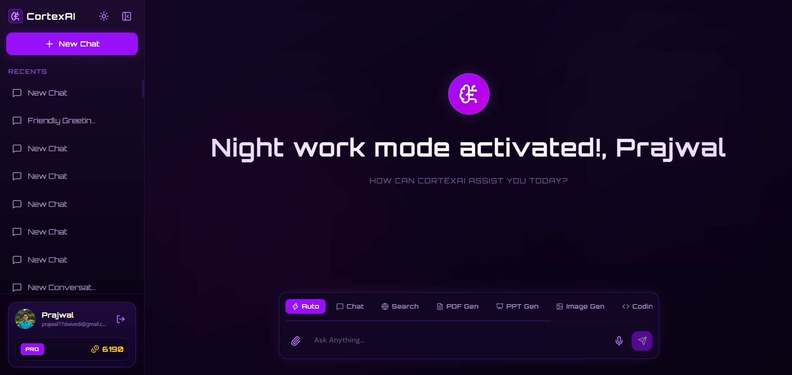
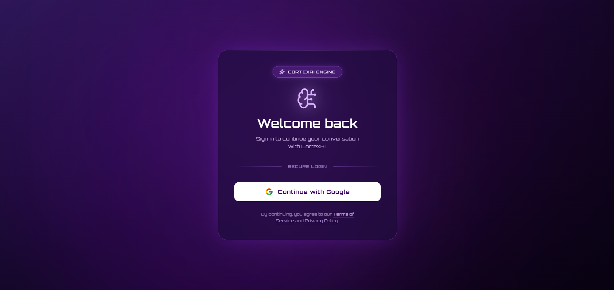
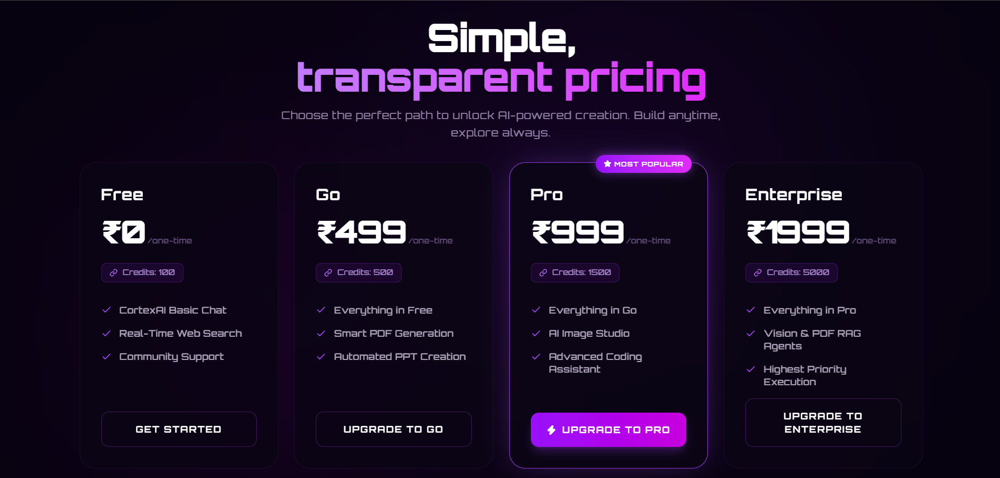
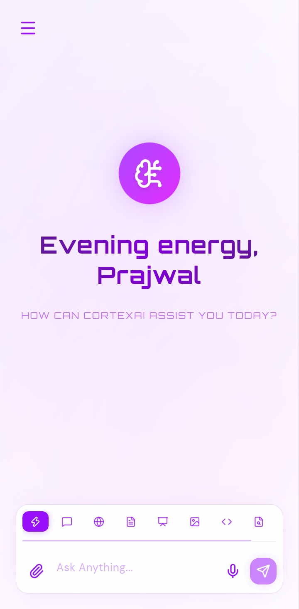
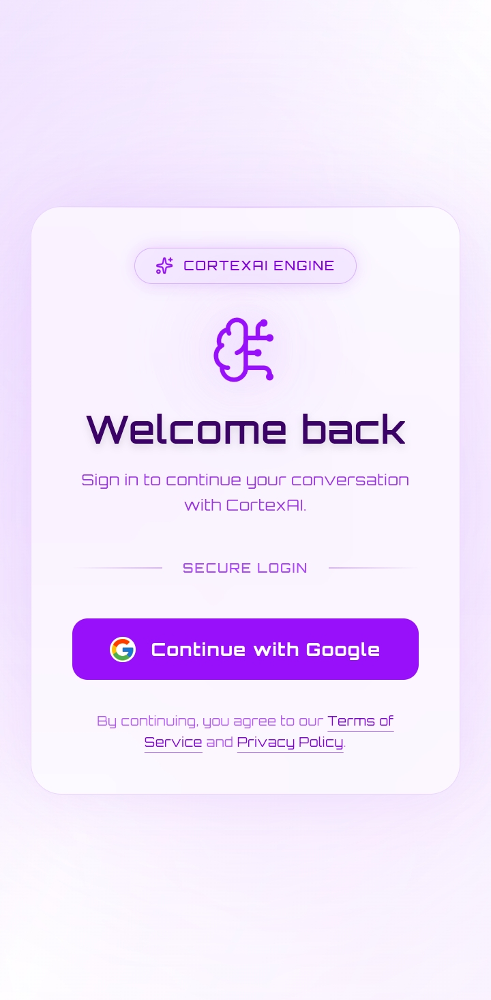
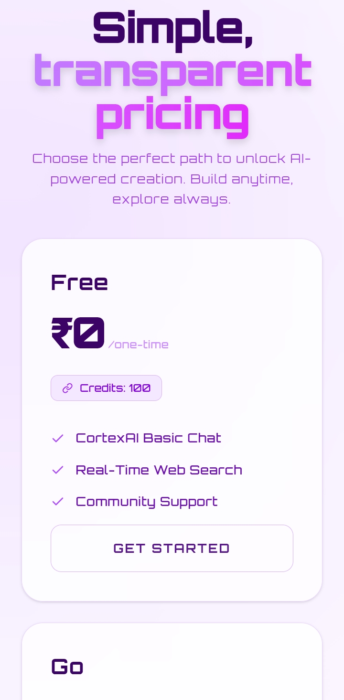

# 🧠 **CortexAI**


**CortexAI** is a production-grade, multi-agent AI platform — built as a personal full-stack project inspired by ChatGPT, Gemini, and Claude. It brings together **8 specialized AI agents** under one roof, backed by a **Node.js microservices architecture**, Redis-powered memory, a RAG pipeline, and a credit-based billing system, to simulate a real-world AI SaaS product end to end.

The platform was built specifically to integrate and demonstrate advanced backend engineering concepts learned over time — microservice decomposition, an API gateway pattern, distributed caching, session and rate-limit management with Redis, vector search, and multi-provider LLM orchestration — all wired together into one cohesive product rather than isolated demos.

From everyday chat and real-time web search, to a VS Code-style coding artifact panel, AI image generation, PDF/PPT generation, and a full Retrieval-Augmented Generation pipeline over your own documents — CortexAI handles the complete lifecycle of an AI assistant platform, from conversation to monetization.

[](https://cortex-ai-nu.vercel.app/)
[](https://github.com/Prajwal-dev-dsa/CortexAi)

---

## 🌟 Key Features

### 🤖 Multi-Agent Intelligence
* **8 Specialized Agents**: Chat, Search, Coding, Image, PDF, PPT, PDF-RAG, and Image Analyzer — each purpose-built with its own model, prompt strategy, orchestration graph, and output pipeline, rather than a single generic model handling every request.
* **Agent Orchestration with LangGraph**: Each agent's internal reasoning — from prompt refinement to tool calls to final formatting — is modeled as a graph via **LangChain** and **LangGraph** (`graph.js`, `router.agent.js`, `state.js`), making the flow predictable, debuggable, and easy to extend with new nodes.
* **Central Agent Router**: A dedicated router layer decides which of the 8 agents should handle a given request, keeping the decision logic separate from each individual agent's own reasoning graph.
* **Multi-Provider LLM Routing**: Agents are deliberately spread across multiple LLM providers — **Groq** (free, low-latency inference), **DeepSeek** (via OpenRouter, for coding), and **Google Gemini** (for vision) — so no single provider becomes a bottleneck or a single point of failure.

### 🧠 Memory, Context & Real-Time UX
* **LLM Memory per Conversation**: Full conversation history is stored in **Redis (Upstash)** via a dedicated memory config layer, giving every agent context-aware, continuous memory across a chat session without re-sending the entire history from the client on every request.
* **Real-Time Conversation Management**: Rename or delete conversations instantly with no page refresh — all conversation state updates are driven through **Redux Toolkit** slices (`conversationSlice`, `messageSlice`) for a snappy, app-like feel.
* **Session Management via Redis**: User sessions are cached in Redis rather than hitting MongoDB on every authenticated request, keeping the auth flow fast under load.
* **Server Wakeup Handling**: A dedicated `ServerWakeupAlert` component gracefully informs the user when backend services are cold-starting, instead of leaving them staring at a frozen UI.

### 💻 Coding Artifact Panel
* **Monaco Editor Integration**: A dedicated, VS Code-style `Artifact` panel opens whenever the Coding Agent generates code — full syntax highlighting, multi-language support, and a familiar editing experience via `@monaco-editor/react`.
* **Live Preview**: HTML/CSS/JS builds can be rendered and previewed live in a full-screen mode directly inside the panel, without leaving the chat.
* **One-Click Copy**: Every code block can be copied instantly, so generated code is immediately usable outside the platform.
* **Syntax-Highlighted Chat Responses**: Beyond the artifact panel, inline code blocks inside regular chat messages are rendered with `react-syntax-highlighter`, and full markdown formatting (tables, lists, bold/italics, GitHub-flavored markdown) is handled via `react-markdown` + `remark-gfm`.

### 🔍 Retrieval-Augmented Generation (RAG)
* **Document Upload & Chunking**: Users can upload a PDF via `multer`, which is parsed using `pdf-parse` and split into semantically meaningful chunks using LangChain's text splitters.
* **Vector Search with Qdrant**: Embeddings are generated through a dedicated `embeddings.js` config and stored in a **Qdrant** vector database, enabling fast similarity search over the document's contents.
* **Grounded Answers**: When a user asks a question, the most relevant chunks are retrieved from Qdrant and passed to the LLM alongside the query, so answers stay grounded in the uploaded document instead of the model's general knowledge.

### 👁️ Vision & Image Generation
* **Image Analyzer Agent**: Uploaded images are sent to the **Google Gemini API**, which returns a detailed natural-language description and breakdown of the image's contents.
* **Prompt-Refined Image Generation**: Rather than passing the user's raw prompt directly to an image model, the Image Agent first refines and enriches the prompt via an LLM, then passes the improved prompt to **pollinations.ai** for generation — producing noticeably better results than a naive pass-through.

### 📄 Document & Slide Generation
* **PDF Agent**: An LLM generates structured, topic-specific content in a strict format, which a dedicated `generatePdf.js` utility then converts (using **pdfkit**) into a styled, CortexAI-themed PDF document.
* **PPT Agent**: Follows the same generate-then-format pipeline as the PDF Agent, but a `generatePpt.js` utility builds a fully styled PowerPoint deck using **pptxgenjs** instead.
* **Persistent File Storage**: All generated artifacts — images, PDFs, and PPTs — are streamed via `streamifier` and uploaded to **Cloudinary** through a shared `uploadToCloudinary.js` utility, giving permanent, reliable access rather than relying on temporary local or short-lived storage.

### 🎨 Interface & Personalization
* **Light / Dark Theme Toggle**: A full theme-switching experience across every screen of the platform, managed through a dedicated `themeSlice` in Redux and persisted per user.
* **Voice Input**: Chat input supports speech-to-text via `react-speech-recognition`, letting users dictate messages instead of typing.
* **Animated, Modern UI**: Smooth transitions and micro-interactions throughout the app powered by `framer-motion`, with `lucide-react` and `react-icons` used for a consistent icon system.
* **Responsive Design**: The interface is built to work cleanly across both desktop and mobile viewports (see the Screenshots section below).

### 🔐 Auth & API Gateway
* **Firebase Authentication**: User sign-in is handled client-side via the Firebase SDK, and verified server-side in the Auth service using `firebase-admin` with a dedicated service account.
* **Single Entry Point Gateway**: Every client request passes through the `gateway` service, which authenticates the request (`protected.middleware.js`), forwards user context to downstream services via custom headers (`proxyWithHeader.js`), and proxies it to the correct microservice using `express-http-proxy`.
* **Request Logging**: All gateway traffic is logged via `morgan` for visibility into what's hitting the system.

### 💳 Credit-Based Billing, Designed to Matter
Billing in CortexAI isn't just "buy more credits." Each paid plan deliberately unlocks a different subset of agents, so the plan itself carries value beyond the raw credit count — giving users a real reason to upgrade rather than just topping up a balance.

| Plan | Price | Credits | Agents Unlocked |
| :--- | :---: | :---: | :--- |
| **Free** | ₹0 | 100 | Chat Agent, Search Agent, Community Support |
| **Go** | ₹499 | 500 | Everything in Free **+ PDF Agent, PPT Agent** |
| **Pro** ⭐ *Most Popular* | ₹999 | 1500 | Everything in Go **+ Image Agent, Coding Agent** |
| **Enterprise** | ₹1999 | 5000 | Everything in Pro **+ Image Analyzer & PDF-RAG Agents**, Highest Priority |

* **Per-Agent Rate Limiting**: Every agent is individually rate-limited through a dedicated `rate.limiting.js` config backed by **Upstash Redis**, preventing abuse and keeping usage fair across the free and paid tiers.
* **Credit Deduction Pipeline**: Every successful agent call runs through a shared `deductCredits.js` utility that debits the user's balance server-side, so credit accounting stays consistent no matter which of the 8 agents was used.
* **Payments via Razorpay**: Plan purchases and credit top-ups are processed through **Razorpay** — orders are created client-side (`createOrder.js`), and verified server-side by the Billing service's `payment.controller.js` and `verifyPayment.js` flow before credits are ever applied.

---

## 🤖 The 8 Agents, In Detail

1. **Chat Agent** — Handles everyday, general-purpose conversation. Powered by a free **Groq** LLM for fast, low-latency responses, with conversation memory pulled from Redis so context carries across turns.
2. **Search Agent** — Answers questions that need current, real-world information by querying the **Tavily API** for real-time web results, then synthesizing an answer with a free **Groq** LLM.
3. **Coding Agent** — Generates, debugs, and explains code using a free **DeepSeek** model (via OpenRouter). Output is rendered in the dedicated Monaco Editor artifact panel, with multi-language support and live preview for HTML/CSS/JS projects.
4. **Image Agent** — Takes a user's raw prompt, refines it through an LLM pass to add detail and clarity, then sends the improved prompt to **pollinations.ai** for free image generation. The resulting image is uploaded and permanently stored on **Cloudinary**.
5. **PDF Agent** — Given a topic, an LLM generates structured content following a strict internal format; **pdfkit** then renders that content into a styled, CortexAI-branded PDF, which is stored on **Cloudinary**.
6. **PPT Agent** — Mirrors the PDF Agent's generate-then-render flow, but outputs a styled PowerPoint deck using **pptxgenjs** instead of a PDF, also stored on **Cloudinary**.
7. **PDF-RAG Agent** — Accepts a user-uploaded PDF, chunks and embeds it, and stores the embeddings in **Qdrant**. User questions are answered via similarity search against those embeddings combined with an LLM call — a complete Retrieval-Augmented Generation pipeline.
8. **Image Analyzer Agent** — Accepts a user-uploaded image and sends it to the **Google Gemini API**, returning a detailed, natural-language description of what the image contains.

Every agent lives as its own file inside `services/agent/agents/`, is wired into the shared LangGraph orchestration layer in `services/agent/graph/`, and shares common infrastructure — rate limiting, credit deduction, memory, Cloudinary uploads — from `services/agent/config/` and `services/agent/utils/`, so adding a 9th agent in the future means writing the agent logic and plugging it into the existing router, not rebuilding the pipeline.

---

## 🛠️ Tech Stack

| Area | Technologies |
| :--- | :--- |
| **Frontend Core** |     |
| **Styling & UI** |     |
| **Chat & Editor UX** |     |
| **Backend Core** |     |
| **Gateway & Infra Middleware** |     |
| **Caching, Sessions & RAG** |    |
| **Agent Framework** |   |
| **File Processing** |      |
| **Auth & Storage** |    |
| **AI / LLM Providers** |     |
| **Payments & Search** |   |
| **Dev Orchestration** |    |
| **Utilities** |    |

---

## 📁 Project Structure

CortexAI follows a **Node.js microservices architecture**: 4 independently deployable services (Auth, Chat, Agent, Billing) sit behind a single API Gateway, with a shared Redis configuration reused across every service and the gateway itself — rather than each service managing its own separate Redis connection logic. Below is the complete, file-level structure of the repository.

```
CortexAi/
├── client/                                  # React + Vite Frontend
│   ├── node_modules/
│   ├── public/
│   │   ├── favicon.svg
│   │   └── icons.svg
│   ├── src/
│   │   ├── assets/
│   │   │   ├── hero.png
│   │   │   ├── react.svg
│   │   │   └── vite.svg
│   │   ├── components/
│   │   │   ├── Artifact.jsx                 # Monaco-powered coding artifact panel + live preview
│   │   │   ├── ChatArea.jsx                 # Main conversation view
│   │   │   ├── ChatInput.jsx                # Message input, incl. voice input
│   │   │   ├── DeleteModal.jsx               # Confirm-delete UI for conversations
│   │   │   ├── EditModal.jsx                 # Rename-conversation UI
│   │   │   ├── MessageList.jsx               # Renders chat messages (markdown + code)
│   │   │   ├── ServerWakeupAlert.jsx         # Cold-start / server-waking UX
│   │   │   └── Sidebar.jsx                   # Conversation list & navigation
│   │   ├── features/                        # API call layer (one file per action)
│   │   │   ├── createConversation.js
│   │   │   ├── createOrder.js                # Razorpay order creation
│   │   │   ├── deleteConversation.js
│   │   │   ├── generateTitle.js              # Auto-generates conversation titles
│   │   │   ├── getAllMessages.js
│   │   │   ├── getConversations.js
│   │   │   ├── getCurrentUser.js
│   │   │   ├── logout.js
│   │   │   ├── sendMessage.js
│   │   │   ├── updateConversationTitle.js
│   │   │   └── verifyPayment.js
│   │   ├── pages/
│   │   │   ├── Billing.jsx                   # Plans, credits & Razorpay checkout
│   │   │   └── Home.jsx                      # Main chat experience
│   │   ├── redux/
│   │   │   ├── slices/
│   │   │   │   ├── conversationSlice.js
│   │   │   │   ├── messageSlice.js
│   │   │   │   ├── themeSlice.js             # Light / dark theme state
│   │   │   │   └── userSlice.js
│   │   │   └── store.js
│   │   ├── App.jsx
│   │   ├── index.css
│   │   └── main.jsx
│   ├── utils/
│   │   ├── axios.js                          # Pre-configured Axios instance
│   │   ├── fileUtils.js
│   │   ├── firebase.js                       # Firebase client SDK config
│   │   └── loadRazorpay.js                   # Dynamically loads Razorpay checkout script
│   ├── .env
│   ├── .gitignore
│   ├── eslint.config.js
│   ├── index.html
│   ├── package.json
│   ├── package-lock.json
│   ├── README.md
│   └── vite.config.js
│
├── screenshots/                              # Project screenshots
│   ├── desktop/
│   │   ├── billing-page.png
│   │   ├── home-page.png
│   │   └── login-page.png
│   └── mobile/
│       ├── billing-page.jpeg
│       ├── home-page.jpeg
│       └── login-page.jpeg
│
└── server/                                   # Microservices Backend
    ├── gateway/                              # API Gateway — single entry point for the client
    │   ├── controllers/
    │   │   └── user.controller.js
    │   ├── middlewares/
    │   │   └── protected.middleware.js       # Verifies auth before proxying downstream
    │   ├── node_modules/
    │   ├── utils/
    │   │   └── proxyWithHeader.js            # Forwards authenticated user context to services
    │   ├── .env
    │   ├── index.js
    │   ├── package-lock.json
    │   └── package.json
    │
    ├── services/
    │   ├── agent/                            # Agent Service — all 8 AI agents live here
    │   │   ├── .temp/                        # Temporary working files during generation
    │   │   ├── agents/                       # One file per agent
    │   │   │   ├── chat.agent.js
    │   │   │   ├── coding.agent.js
    │   │   │   ├── image.agent.js
    │   │   │   ├── imageAnalyzer.agent.js
    │   │   │   ├── pdf.agent.js
    │   │   │   ├── pdfRag.agent.js
    │   │   │   ├── ppt.agent.js
    │   │   │   └── search.agent.js
    │   │   ├── config/
    │   │   │   ├── embeddings.js             # Embedding model config for RAG
    │   │   │   ├── llm.models.js             # Multi-provider LLM configuration
    │   │   │   ├── memory.js                 # Redis-backed conversation memory
    │   │   │   ├── multer.js                 # File upload handling config
    │   │   │   ├── qdrant.js                 # Qdrant vector DB client config
    │   │   │   ├── rate.limiting.js          # Per-agent rate limiting via Upstash Redis
    │   │   │   └── tavily.js                 # Tavily search API config
    │   │   ├── controllers/
    │   │   │   └── agent.controller.js
    │   │   ├── graph/                        # LangGraph agent orchestration
    │   │   │   ├── graph.js
    │   │   │   ├── router.agent.js           # Routes requests to the correct agent
    │   │   │   └── state.js
    │   │   ├── node_modules/
    │   │   ├── routes/
    │   │   │   └── agent.route.js
    │   │   ├── utils/
    │   │   │   ├── deductCredits.js          # Server-side credit deduction on agent use
    │   │   │   ├── generatePdf.js            # pdfkit rendering pipeline
    │   │   │   ├── generatePpt.js            # pptxgenjs rendering pipeline
    │   │   │   ├── getAllMessages.js
    │   │   │   └── uploadToCloudinary.js     # Shared Cloudinary upload utility
    │   │   ├── .env
    │   │   ├── index.js
    │   │   ├── package-lock.json
    │   │   └── package.json
    │   │
    │   ├── auth/                             # Auth Service — Firebase-backed authentication
    │   │   ├── config/
    │   │   │   ├── db.js
    │   │   │   └── firebase.js               # Firebase Admin SDK initialization
    │   │   ├── controllers/
    │   │   │   ├── auth.controller.js
    │   │   │   └── payment.controller.js
    │   │   ├── models/
    │   │   │   └── user.model.js
    │   │   ├── node_modules/
    │   │   ├── routes/
    │   │   │   ├── auth.route.js
    │   │   │   └── payment.route.js
    │   │   ├── utils/
    │   │   │   └── credits.js
    │   │   ├── .env
    │   │   ├── index.js
    │   │   ├── package-lock.json
    │   │   ├── package.json
    │   │   └── serviceAccountKey.json        # Firebase Admin SDK credentials
    │   │
    │   ├── billing/                          # Billing Service — plans, credits & Razorpay
    │   │   ├── config/
    │   │   │   ├── db.js
    │   │   │   ├── plans.js                  # Free / Go / Pro / Enterprise tier definitions
    │   │   │   └── razorpay.js
    │   │   ├── controllers/
    │   │   │   └── billing.controller.js
    │   │   ├── models/
    │   │   │   └── payment.model.js
    │   │   ├── node_modules/
    │   │   ├── routes/
    │   │   │   └── billing.route.js
    │   │   ├── .env
    │   │   ├── index.js
    │   │   ├── package-lock.json
    │   │   └── package.json
    │   │
    │   └── chat/                             # Chat Service — conversations & messages
    │       ├── config/
    │       │   └── db.js
    │       ├── controllers/
    │       │   └── chat.controller.js
    │       ├── models/
    │       │   ├── conversation.model.js
    │       │   └── message.model.js
    │       ├── node_modules/
    │       ├── routes/
    │       │   └── chat.route.js
    │       ├── .env
    │       ├── index.js
    │       ├── package-lock.json
    │       └── package.json
    │
    ├── shared/
    │   └── redis/
    │       └── redis.js                      # Shared Upstash Redis client, reused across every service & the gateway
    │
    ├── node_modules/
    ├── package.json                          # Root — orchestrates running all services together
    └── package-lock.json
```

Each service under `services/` is a fully self-contained Express application with its own `config/`, `controllers/`, `routes/`, `package.json`, and environment file — the kind of separation that lets each piece scale, restart, or be redeployed independently of the others — while every service and the gateway reach into the same `shared/redis/redis.js` client instead of duplicating connection logic, and the `gateway` remains the single, unified entry point the client actually talks to.

---

## 📸 Screenshots

A look at CortexAI across desktop and mobile.

| Home | Login | Billing |
| :---: | :---: | :---: |
|  |  |  |

| Home (Mobile) | Login (Mobile) | Billing (Mobile) |
| :---: | :---: | :---: |
|  |  |  |

---

## 📬 Contact

**Prajwal**

[](https://www.linkedin.com/in/prajwaldwivedi/)
[](mailto:prajwal77dwivedi@gmail.com)

**GitHub Repository:** https://github.com/Prajwal-dev-dsa/CortexAi

**Live Application:** https://cortex-ai-nu.vercel.app/
